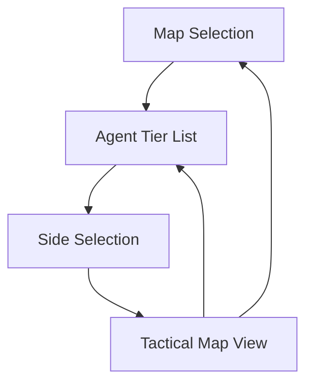

## 1. Product Overview
A premium Valorant tactical coaching web application that helps Gold/Silver ELO players improve their gameplay through map-specific agent tier lists and interactive tactical overlays. The app provides strategic guidance for each map, showing optimal agent picks, positioning, movement paths, and utility usage to enhance competitive performance.

Target users are Valorant players seeking to improve their tactical understanding and climb the competitive ladder through data-driven insights.

## 2. Core Features

### 2.1 User Roles
No user roles required - this is a publicly accessible tactical tool that doesn't require authentication.

### 2.2 Feature Module
The tactical planner consists of the following main pages:
1. **Map Selection**: Grid of all Valorant maps with thumbnails and selection capability
2. **Agent Tier List**: Map-specific agent rankings (S/A/B/C tiers) with role icons and reasoning
3. **Side Selection**: Attack or Defense side choice for tactical planning
4. **Tactical Map View**: Interactive map overlay with spawn positions, movement paths, utility spots, and tactical tips panel

### 2.3 Page Details
| Page Name | Module Name | Feature description |
|-----------|-------------|---------------------|
| Map Selection | Map Grid | Display 10 Valorant maps (Pearl, Ascent, Bind, Haven, Split, Fracture, Lotus, Sunset, Abyss, Icebox) with thumbnail images and hover effects |
| Map Selection | Map Card | Each card shows map name, thumbnail, and selection button with smooth hover animations |
| Agent Tier List | Tier Headers | Display S/A/B/C tier sections with color-coded backgrounds and tier labels |
| Agent Tier List | Agent Cards | Show agent portrait, role icon (Duelist/Controller/Sentinel/Initiator), agent name, and tier badge |
| Agent Tier List | Meta Reasoning | Include brief explanation text for why agents are placed in each tier for the selected map |
| Side Selection | Side Buttons | Two prominent buttons for Attack and Defense side selection with tactical icons |
| Tactical Map View | Interactive Map | Display selected map with zoom/pan functionality and tactical overlay system |
| Tactical Map View | Spawn Positions | Mark recommended spawn locations with colored indicators |
| Tactical Map View | Movement Paths | Draw arrows and lines showing suggested movement routes |
| Tactical Map View | Utility Spots | Highlight grenade and ability usage locations with ability-specific icons |
| Tactical Map View | Tactical Tips Panel | Show written tactical advice including entry points, defensive anchors, utility timings, and rotation cues |
| Tactical Map View | Progress Indicator | Display current step in selection flow (Map → Agent → Side → Tactics) |

## 3. Core Process
Users navigate through a 4-step selection process to access tactical information. First, they select a map from the grid view. Next, they choose an agent from the map-specific tier list. Then, they pick their side (Attack or Defense). Finally, they view the interactive tactical map with overlays and tips.

## 4. User Interface Design

### 4.1 Design Style
- **Primary Colors**: Dark navy (#0F1419) and black (#000000) backgrounds
- **Secondary Colors**: Valorant red (#FF4655) for accents and highlights
- **Button Style**: Rounded corners with subtle gradients and hover effects
- **Typography**: Modern sans-serif fonts, 16px base size with responsive scaling
- **Layout**: Card-based design with grid layouts and smooth transitions
- **Icons**: Valorant-style minimalist icons with sharp edges and tactical feel

### 4.2 Page Design Overview
| Page Name | Module Name | UI Elements |
|-----------|-------------|-------------|
| Map Selection | Map Grid | 2-column desktop, 1-column mobile grid with 16:9 aspect ratio thumbnails, dark overlay on hover, subtle scale animation |
| Agent Tier List | Tier Sections | Color-coded backgrounds (S-tier: gold, A-tier: green, B-tier: blue, C-tier: gray), horizontal card layout with role icons |
| Agent Tier List | Agent Cards | 80x80px portraits, role badges in top-right, tier letter in bottom-left, smooth hover elevation effect |
| Side Selection | Side Buttons | Large rectangular buttons with tactical icons, red accent on hover, smooth transition animations |
| Tactical Map View | Map Container | Full-width map with dark UI controls, zoom buttons in bottom-right, pan enabled via drag |
| Tactical Map View | Overlay Elements | Semi-transparent colored markers, dashed movement lines, numbered utility spots with legend |
| Tactical Map View | Tips Panel | Collapsible sidebar with tactical advice, Valorant-themed typography, organized by categories |

### 4.3 Responsiveness
Desktop-first design approach with mobile adaptation. Touch interaction optimization for map zoom/pan functionality. Responsive breakpoints at 768px and 1024px for optimal mobile and tablet experience.

### 4.4 3D Scene Guidance
Not applicable - this is a 2D tactical overlay application.