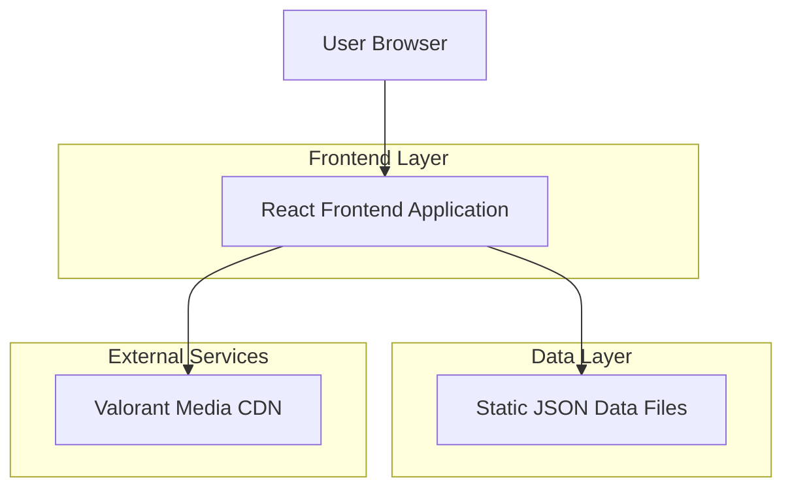

## 1. Architecture design



## 2. Technology Description
- Frontend: React@18 + tailwindcss@3 + vite
- Initialization Tool: vite-init
- Backend: None (static JSON data files)
- Additional Dependencies: 
  - react-zoom-pan-pinch (for map interaction)
  - lucide-react (for icons)
  - framer-motion (for smooth transitions)

## 3. Route definitions
| Route | Purpose |
|-------|---------|
| / | Map selection page - displays all available Valorant maps |
| /:mapId | Agent tier list page for selected map |
| /:mapId/:agentId | Side selection page (Attack/Defense) |
| /:mapId/:agentId/:side | Tactical map view with interactive overlays |

## 4. API definitions
No backend API required. All data is served through static JSON files.

### 4.1 Data Structure Examples

Map Data Structure:
```json
{
  "id": "pearl",
  "name": "Pearl",
  "thumbnail": "/maps/pearl-thumb.jpg",
  "image": "/maps/pearl-full.jpg"
}
```

Agent Tier Data Structure:
```json
{
  "mapId": "pearl",
  "tiers": {
    "S": [
      {
        "id": "harbor",
        "name": "Harbor",
        "role": "controller",
        "reasoning": "Strong water walls for site control",
        "portrait": "/agents/harbor-portrait.png"
      }
    ],
    "A": [...],
    "B": [...],
    "C": [...]
  }
}
```

Tactical Data Structure:
```json
{
  "mapId": "pearl",
  "agentId": "harbor",
  "side": "attack",
  "spawns": [
    {"x": 100, "y": 200, "label": "A-main spawn"}
  ],
  "movementPaths": [
    {"from": {"x": 100, "y": 200}, "to": {"x": 300, "y": 400}, "type": "rush"}
  ],
  "utilitySpots": [
    {"x": 250, "y": 350, "ability": "cascade", "timing": "pre-plant"}
  ],
  "tips": [
    {
      "category": "Entry Points",
      "content": "Use cascade to clear common angles before peeking"
    }
  ]
}
```

## 5. Server architecture diagram
Not applicable - this is a client-side only application with static data files.

## 6. Data model
### 6.1 Data model definition
Static JSON files structure:
- `/data/maps.json` - List of all Valorant maps
- `/data/tiers/:mapId.json` - Agent tier lists per map
- `/data/tactics/:mapId/:agentId/:side.json` - Tactical data for each map+agent+side combination

### 6.2 Data Definition Language
Not applicable - using static JSON files instead of database tables.

### 6.3 File Structure
```
src/
├── components/
│   ├── MapSelector/
│   ├── AgentTierList/
│   ├── SideSelector/
│   ├── TacticalMap/
│   └── common/
├── data/
│   ├── maps.json
│   ├── tiers/
│   └── tactics/
├── hooks/
├── utils/
└── assets/
    ├── maps/
    └── agents/
```